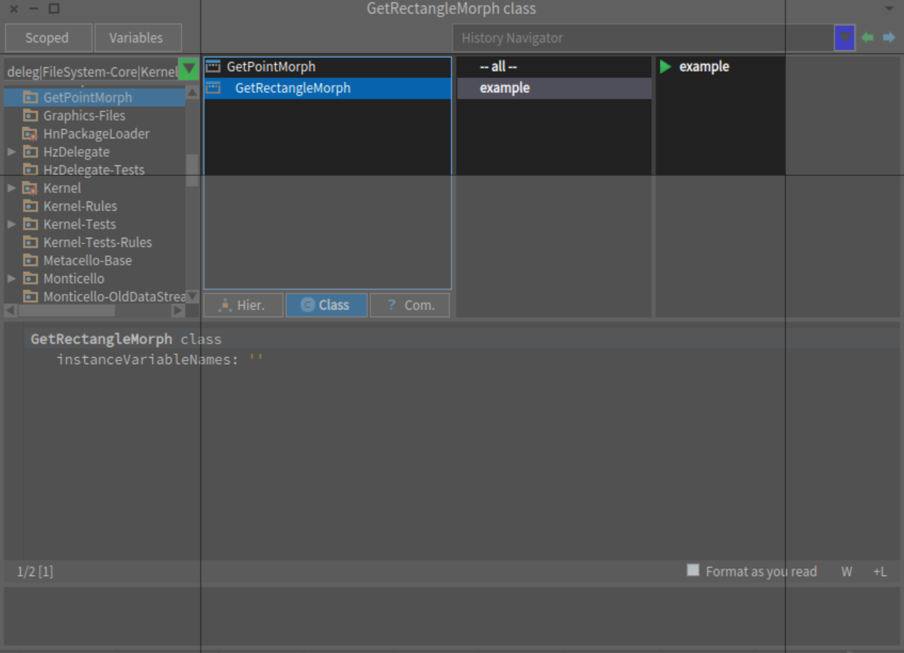

# GetPointMorph

This package adds two interaction morphs for getting a user selected point or rectange.



# Installation

```smalltalk
Metacello new
   baseline: 'GetPointMorph';
   repository: 'github://DraagrenKirneh/GetPointMorph';
   load.
```

# Usage 

See examples found at the class side of both **GetPointMorph** and **GetRectangleMorph**.